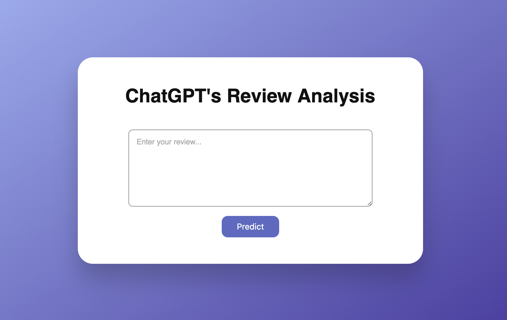

# 🚀 ChatGPT's Review Analysis - Classification Web App Project

A simple yet effective NLP-based web application that classifies user reviews as **Good ✅** or **Bad ❌** using a trained machine learning model. Built using **Python, Scikit-learn, Flask, and NLTK**, with a clean front-end built in **HTML, CSS, and JavaScript**.

---

## 📸 Screenshot



---

## 🛠️ Features

- ✅ Real-time review sentiment prediction
- 🔠 Text preprocessing (tokenization, lemmatization, stopword removal)
- 📊 TF-IDF vectorization
- 🤖 ML model built using SVC
- 🌐 Interactive and responsive web UI

---

## 🧰 Tech Stack

| Category         | Tools/Libs Used                          |
|------------------|------------------------------------------|
| Language         | Python 3                                 |
| Libraries        | Scikit-learn, NLTK                       |
| Model            | SVC                                      |
| Web Framework    | Flask                                    |
| Frontend         | HTML, CSS, JavaScript                    |
| Visualization    | Matplotlib, Seaborn (for analysis)       |

---

## 🧪 How It Works

1. **Text Preprocessing**:  
   Lowercasing, punctuation removal, tokenization, stopword removal, and lemmatization.

2. **Feature Extraction**:  
   TF-IDF vectorization with a max feature limit.

3. **Model Training**:  
   Trained using Logistic Regression / SVC on the transformed TF-IDF matrix.

4. **Model Saving**:  
   Model and vectorizer saved using `pickle`.

5. **Flask App**:  
   Accepts user input → preprocesses it → transforms using saved vectorizer → predicts using saved model.

---

## 🔧 Setup Instructions

1. **Clone the repository**
```bash
git clone https://github.com/your-username/review-sentiment-app.git
cd review-sentiment-app
```

2. **Install dependencies**
```bash
pip install -r requirements.txt
```
```
Download Dataset : https://www.kaggle.com/datasets/charunisa/chatgpt-sentiment-analysis?select=file.csv
```

3. **Train the model**
```bash
python train_model.py
```

4. **Run the Flask app**
```bash
python app.py
```

5. **Open in Browser**
```bash
http://localhost:5000
```
